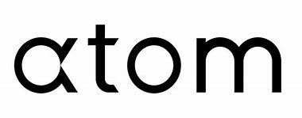

# The Basic Unit of Investment Management - Atom

---
## Origin of Atom Finance
---
* Founded by Eric Shoykhet in 2018
* Shoykhet noticed a massive information gap between enterprise platforms and retail investors; aims to build a bridge between the two.
* Atom uses the seed round funding as their funding strategy and has raised over 18 million dollars.
---
## Atom's Aim 
* Provide an accessible and affordable institutional grade platform for investment information
* The intended consumer is YOU and ME. Traders who cannot afford spends thousands on investment terminals like investment institutions can. 
* The market size of retail investors is huge. Any person who wishes to invest is targeted audience for Atom.
> "American households own $29 trillion worth of equities—more than 58% of the U.S. equity market—either directly or indirectly through mutual funds, retirement accounts, and other investments." as published by the SEC in 2020
* Atom offers two services:
1. A no-cost solution which offers market data to help one make stock decisions
2. A low cost solution for large financial institutions which will provide additional services.
* The goal of Atom is to create a terminal that provides the service of something like Bloomberg but at fraction of the cost. Bloomberg costs roughly $24,000 a year.
* Some technologies that Atom has implemented in their system are React, Google Analytics, Heroku, Segment, Node, and Amazon Web Service. These technologies provide cloud storage, data research and cleanup, analytic tracking, content delivery, and cross-platform accessibilty. 
---
## Atom's Fintech Domain
* Atom is apart of the Investment Management domain
* Major trends and innovations that has disrupted the Investment Management domain:
1. Active to Passive 
2. Use of AI technology
3. Use of Big Data
4. More development of software for investment purposes
5. Creation of various cryptocurrencies
* Other companies in this domain are E*Trade, BlackRock, JPMorgan Chase, Goldman Sachs
---
## The Results of Atom
* Atom's business impact is still in the early stages as  it is only it's 3rd year present. Nonethless, a platform that offers many of the same investment tools as the "big dogs of Wall Street" at a much lower cost is a feat that many other could not reach. Being able provide a platform for traders of all levels will revolutize the domain of investment management. The impact is shown by the amount of funding this venture has raised since its start, 18 million dollars and counting.
* 
* Atom being a company  recently founded does not have many  competitors who are looking to create something that rivals the  Bloomberg terminal. Atom seems to be ahead of other competitors like Financial Toolbelt with the services they offer. For example, Atom offers a portfolio integration tool that will put all of your investment accounts in one place. While Atom is no Bloomberg yet, it is only the company of the newcomers who has the potential to in the future.
## Recommendations for Atom
* Two services I would advise Atom Finance to add:
1. Brokerage - Would be easier for customers to use just one platform instead of integrating a bunch of them.
2. Wealth Management - Learning about investments can be intimidating and some guidance will look favorable to  customers.

* Both services would create a streamline go-to product for investors that would be seen as more favorable for customers rather than using multiple platforms.
* Besides using big data, cloud infracture, and payment technologies that Atom already employs, robo-advisors would cover the addition of the wealth management service.
* Robo-advisors are cost-efficent and effective tools that will cater portfolio options based on the habits of the investor.
>"Wealth management solutions are often driven by machine learning with automated trading and portfolio rebalancing." 
---
## Citations

